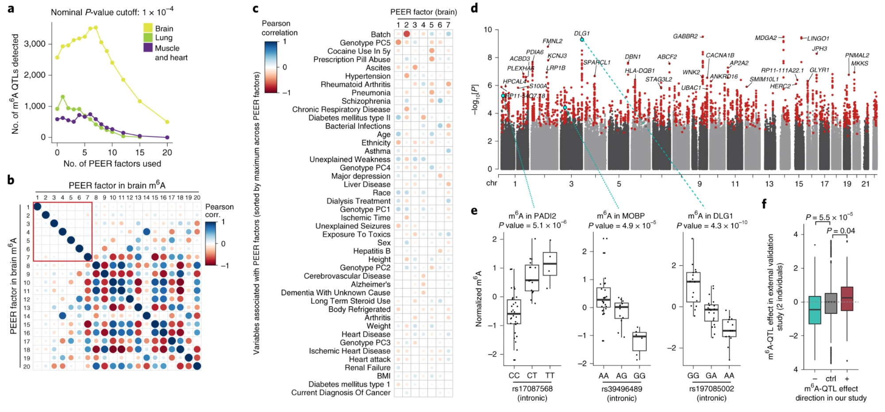

**Research interest:**

1.  m6A
2.  pseudoU

## Completed work

  

    
    
Xiong X.#, James B#, Boix C#, et al., *In Revision, Cell* Single-cell epigenomic dissection of Alzheimer's disease pinpoints causal genetic variants and reveals epigenome erosion.

  

  

    
    
Xiong X#, Hou L#, et al., *Nat Genet, 2021* Genetic drivers of m6A methylation in human brain, lung, heart and muscle, and their contributions to disease heritability

  

## More is coming! Please join us to make it happen!
